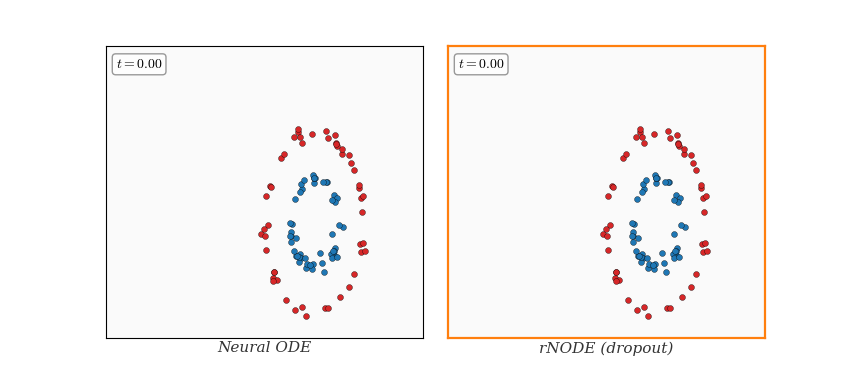

# Random Batch Neural ODEs (rNODE)

<p align="center">
  
</p>

Companion code for

> A. Álvarez-López and M. Hernández, *Convergence, design and training of continuous-time dropout as a random batch method*, arXiv preprint [arXiv:2510.13134](https://arxiv.org/abs/2510.13134), 2025.

## What is this?

**Neural ODEs** model depth as continuous integration of a learned vector field. **Dropout** — randomly silencing neurons during forward passes — is a standard regulariser in discrete networks, but applying it in continuous time raises new challenges: naïve masking can break the ODE solver's convergence guarantees.

This work frames **continuous-time dropout as a random batch method (RBM)**. At each time interval of length *h*, a random subset of neurons is sampled and the output is rescaled to keep the estimator unbiased (Horvitz–Thompson correction).

This repository contains the code for five numerical experiments:

1. trajectory convergence;
2. optimal batch design;
3. cost–accuracy trade-offs;
4. measure transport;
5. training consistency.

## Repository structure

```text
rnode/          Core models, batch schemes, integrators, objectives,
                training, design, data, and transport utilities
experiments/    Experiment scripts, plotting modules, and the main runner
tests/          Numerical and reproducibility tests
assets/         README header image
```

## Installation

Python 3.10 or newer is required.

```bash
python -m venv .venv
source .venv/bin/activate
python -m pip install --upgrade pip
python -m pip install -r requirements.txt
```

Run the test suite with `python -m pytest -q`.

## Running the experiments

Run all five experiments in quick mode:

```bash
python -m experiments.run_all run all
```

Run one experiment:

```bash
python -m experiments.run_all run exp1
```

Available names are `exp1`, `exp2`, `exp3`, `exp4`, and `exp5`.

Full runs can be computationally expensive and require explicit confirmation:

```bash
python -m experiments.run_all run all --full --confirm-full \
  --output-root outputs/current_paper_full
```

Regenerate figures from existing results:

```bash
python -m experiments.run_all plots all
```

## Experiments

### 1. Trajectory convergence

Tests strong trajectory convergence for several random-batch sampling schemes
and validates the analytical batch-design functional.

### 2. Optimal batch design

Builds balanced neuron partitions using calibration data and evaluates them on
an independent test set.

### 3. Cost–accuracy trade-offs

Compares integration error, random-batch error, theoretical computational cost,
and measured wall-clock time.

### 4. Measure transport

Compares full and random-batch particle flows using deterministic kernel
density estimates and terminal transport errors.

### 5. Training consistency

Studies fixed-control consistency, ensemble variance reduction, and training
of the expected random-batch objective with a single shared control.

## Reproducibility

All random seeds and experiment settings are saved with the generated results.
Each result directory contains a `manifest.json` file recording the
configuration, software versions, device, numerical precision, Git commit, and
timestamp.

Generated files are written to a local `outputs/` directory. This directory is
created automatically and is not included in the repository. Experiment
calculations and plotting are separate, so figures can be regenerated without
repeating training or integration.

## Citation

```bibtex
@article{alvarez2025dropout,
  title     = {Convergence, design and training of continuous-time dropout
               as a random batch method},
  author    = {{\'A}lvarez-L{\'o}pez, Antonio and Hern{\'a}ndez, Mart{\'\i}n},
  journal   = {arXiv preprint arXiv:2510.13134},
  year      = {2025},
  url       = {https://arxiv.org/abs/2510.13134}
}
```
